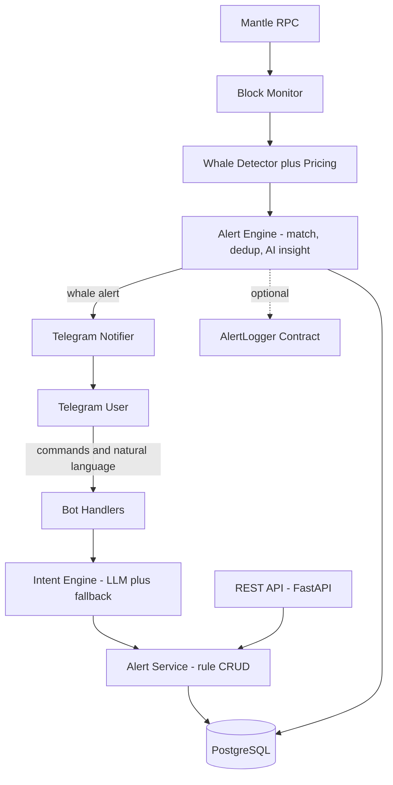

<div align="center">

# Mantle Alpha Agent

<strong>An AI-powered Telegram agent that monitors the Mantle blockchain in real time and delivers whale alpha signals straight to your chat.</strong>

<br/>
<br/>

[](https://www.python.org/)
[](https://fastapi.tiangolo.com/)
[](https://www.postgresql.org/)
[](https://redis.io/)
[](https://www.mantle.xyz/)
[](https://core.telegram.org/bots)
[](#testing)
[](#license)

</div>

---

## Overview

Mantle Alpha Agent turns plain English into live on-chain monitoring. Tell it
"Track mETH whale trades above $10,000" and it converts your request into a
structured rule, watches every Mantle block, prices each move in USD, writes a
concise AI insight, and notifies you the moment a whale moves. Slash commands and
natural language run through the exact same rule engine, so you can talk to it
however you like.

```
Whale Alert
Token:  mETH
Value:  $120,450
From:   0x1234...5678
To:     0xabcd...ef01
AI Insight: A wallet accumulated $120k of mETH, about 4.2x the 24h average,
   which may indicate accumulation.
Tx: https://explorer.mantle.xyz/tx/0x...
```

## Table of Contents

| | |
|---|---|
| [Features](#features) | [Telegram Commands](#telegram-commands) |
| [Architecture](#architecture) | [Natural Language](#natural-language) |
| [Tech Stack](#tech-stack) | [REST API](#rest-api) |
| [Quick Start](#quick-start-docker) | [Smart Contract](#smart-contract) |
| [Local Development](#local-development) | [Configuration](#configuration) |
| [Testing](#testing) | [Deployment](#deployment) |
| [Security](#security) | [Project Structure](#project-structure) |

## Features

| Capability | What it does |
|---|---|
| Conversational AI | Natural language and slash commands share one rule engine |
| Intent engine | GPT-4o-mini extracts structured intents, with a deterministic fallback so it runs with no API key |
| Real-time monitoring | Polls Mantle blocks, decodes Transfer and Swap events, values them in USD |
| Whale detection | Configurable per-rule USD thresholds for buys, sells, transfers, and swaps |
| AI insights | Concise (under 50 words) analyst notes with 24h-average context |
| Modular pricing | CoinGecko then DeFiLlama then static fallback, with TTL caching |
| No duplicates | The same on-chain action never alerts twice, enforced at the database layer |
| On-chain logging | Optional: record alert fingerprints to a Solidity AlertLogger contract |
| REST API | Full OpenAPI docs at `/docs` |
| Production ready | Docker Compose, Alembic migrations, Celery, structured logging, rate limiting |

## Architecture

Each concern runs as its own scalable process, backed by PostgreSQL and Redis.



Processes: `api`, `bot`, `worker` (monitor), `celery` plus `beat` (maintenance).

## Tech Stack

| Layer | Technology |
|---|---|
| Backend | Python 3.12, FastAPI, SQLAlchemy 2.0 (async), Alembic |
| Blockchain | web3.py, Mantle RPC |
| AI | OpenAI GPT-4o-mini behind a swappable provider layer |
| Bot | python-telegram-bot |
| Queue | Redis, Celery |
| Data | PostgreSQL |
| Tooling | Pytest, Ruff, Black, Docker, Pydantic Settings |

## Quick Start (Docker)

```bash
git clone https://github.com/amaanbuild/Mantle-Alpha-Agent.git
cd Mantle-Alpha-Agent
cp .env.example .env
#  set TELEGRAM_BOT_TOKEN (from @BotFather)
#  optionally set OPENAI_API_KEY (it works without one via the rule-based fallback)
docker compose up --build
```

This starts PostgreSQL and Redis, runs migrations, then launches the API, bot,
monitor, and Celery. Open the API docs at `http://localhost:8000/docs`, then
message your bot:

```
/start
Track mETH whale trades above $10,000
/myalerts
Show today's whale activity
```

## Local Development

No Docker needed. Full guide in [docs/LOCAL_SETUP.md](docs/LOCAL_SETUP.md).

```bash
python -m venv .venv && source .venv/bin/activate   # Windows: .venv\Scripts\activate
pip install -r requirements-dev.txt
cp .env.example .env

# Zero-infra option: run on SQLite by setting in .env
#   DATABASE_URL=sqlite+aiosqlite:///./dev.db

python -m backend.bot.telegram_bot     # Telegram bot
python -m backend.worker               # blockchain monitor
uvicorn backend.main:app --reload      # REST API plus docs
```

## Telegram Commands

| Command | Description |
|---|---|
| `/start` | Welcome and onboarding |
| `/help` | All commands and examples |
| `/track <token> <amount>` | Create a rule, e.g. `/track mETH 10000` |
| `/untrack <token>` | Remove tracking, e.g. `/untrack mETH` |
| `/myalerts` | List active rules |
| `/history` | Recent alerts |
| `/status` | Active rules, totals, last alert, bot health |
| `/settings [on\|off]` | Toggle notifications |
| `/stop` | Pause all notifications |

## Natural Language

The same engine powers free-text requests:

> Track MNT buys above $50,000
>
> Notify me when smart money accumulates mETH
>
> Stop tracking MNT
>
> Show today's whale activity

The AI converts each message into a validated rule before anything executes,
and an injection-screening layer keeps prompt attacks out.

## REST API

| Method | Path | Description |
|---|---|---|
| GET | `/health` | Liveness plus database and RPC health |
| GET | `/alerts?telegram_id=` | List a user's rules |
| POST | `/alerts` | Create a rule |
| DELETE | `/alerts/{id}?telegram_id=` | Deactivate a rule |
| GET | `/history` | Recent alerts (optionally per user or today) |
| GET | `/users/{id}` | Fetch a user |

Interactive docs live at `/docs` (Swagger) and `/redoc`. Mutating endpoints
honor an optional `X-API-Key` header when `API_KEY` is set.

## Smart Contract

An optional Solidity `AlertLogger` records an immutable fingerprint of each
alert on Mantle. Source, Hardhat deploy and verify scripts, and tests live in
[contracts/](contracts/). To enable, set in `.env`:

```
ENABLE_ONCHAIN_LOGGING=true
ALERT_LOGGER_CONTRACT_ADDRESS=0x...
ALERT_LOGGER_PRIVATE_KEY=0x...
```

Each alert then emits `AlertLogged(alertHash, token, amountUsd, txHash, reporter, timestamp)`.

## Configuration

Every setting lives in [backend/config.py](backend/config.py) and is documented
in [.env.example](.env.example). Swap the LLM provider by setting `LLM_PROVIDER`
and adding a subclass in [backend/ai/llm_provider.py](backend/ai/llm_provider.py).
Add price sources in [backend/pricing/providers.py](backend/pricing/providers.py).

<details>
<summary><strong>Key environment variables</strong></summary>

| Variable | Purpose |
|---|---|
| `TELEGRAM_BOT_TOKEN` | Bot token from @BotFather (required to run the bot) |
| `OPENAI_API_KEY` | Optional; enables LLM intent and insights |
| `DATABASE_URL` | Async Postgres URL, or SQLite for local dev |
| `REDIS_URL` | Cache, rate limit, Celery broker, monitor cursor |
| `MANTLE_RPC_URL` | Mantle RPC endpoint |
| `DEFAULT_WHALE_THRESHOLD_USD` | Threshold used when a user gives no amount |
| `API_KEY` | Optional protection for REST mutating endpoints |

`postgres://` URLs from managed hosts are auto-converted to the async driver.

</details>

## Testing

```bash
pip install -r requirements-dev.txt
pytest                 # 70 tests on in-memory SQLite, no external services
pytest --cov=backend   # coverage report
ruff check backend     # lint
black backend tests    # format
```

Coverage spans intent extraction, pricing, whale detection, the database layer,
the alert engine end to end, REST endpoints, event decoding, security helpers,
and message formatting.

## Security

- Secrets only via environment variables, with no hardcoded credentials.
- Per-user rate limiting (Redis-backed, in-memory fallback).
- Input validation plus prompt-injection heuristics before any LLM call.
- RPC, pricing, and LLM calls wrapped with retries and graceful degradation.
- Atomic database transactions and idempotent alert delivery.

## Deployment

> Tip: a Telegram bot in polling mode needs no public URL, so hosting is simple.

- [docs/DEPLOY_RENDER.md](docs/DEPLOY_RENDER.md): free deploy on Render, no credit card (recommended). Runs the API, bot, and monitor as one service via [backend/run_all.py](backend/run_all.py).
- [docs/DEPLOYMENT.md](docs/DEPLOYMENT.md): general production guidance (webhooks, scaling, migrations).
- [docker-compose.yml](docker-compose.yml): full local or self-hosted stack.

## Project Structure

<details>
<summary><strong>Expand the tree</strong></summary>

```
backend/
  ai/          LLM provider abstraction, intent engine, insight generator
  alerts/      rule matching, alert engine, rule service, on-chain logger
  api/         FastAPI routers, schemas, dependencies
  blockchain/  Mantle RPC client, event decoding, block monitor, whale detector
  bot/         Telegram handlers, formatters, application wiring
  core/        domain types, logging, security, domain objects
  database/    SQLAlchemy models, async session, repositories
  pricing/     providers, cache, price service
  tasks/       Celery app plus periodic tasks
  config.py    Pydantic settings (single source of configuration)
  main.py      FastAPI app
  worker.py    real-time monitor process
contracts/     Solidity AlertLogger plus Hardhat deploy, verify, tests
alembic/       database migrations
tests/         pytest suite across every layer
docker/        Dockerfile
```

</details>

## Contributing

Contributions are welcome. Fork the repo, create a feature branch, keep the
suite green (`pytest`, `ruff check`, `black`), and open a pull request with a
clear description of the change.

## License

Released under the MIT License.
